# Cesta k druhé vrstvě Bitcoinu

Tento kurz je teoretickou lekcí o technickém fungování Lightning Network.

Vítejte ve vzrušujícím světě Lightning Network, druhé vrstvě Bitcoinu, která je sofistikovaná a plná potenciálu. Chystáme se ponořit do technických hlubin této technologie, aniž bychom se zaměřovali na konkrétní tutoriály nebo scénáře použití. Pro co nejlepší využití tohoto kurzu je nezbytné mít pevné porozumění Bitcoinu. Jedná se o zážitek, který vyžaduje vážný a soustředěný přístup. Můžete také zvážit paralelní absolvování kurzu LN 202, který nabízí praktičtější pohled na toto průzkum. Připravte se na cestu, která by mohla změnit vaše vnímání ekosystému Bitcoinu.

Užijte si objevování!

+++

# Základy
<partId>32647d62-102b-509f-a3ba-ad1d6a4345f1</partId>

## Porozumění Lightning Network
<chapterId>df6230ae-ff35-56ea-8651-8e65580730a8</chapterId>

Lightning Network je druhovrstvová platební infrastruktura postavená na síti Bitcoin, která umožňuje rychlé a nízkonákladové transakce. Pro plné porozumění fungování Lightning Network je nezbytné rozumět, co jsou platební kanály a jak fungují.

Platební kanál Lightning je druh "soukromé dráhy" mezi dvěma uživateli, která umožňuje rychlé a opakované transakce v Bitcoinu. Když je kanál otevřen, je mu přidělena pevná kapacita, která je předem definována uživateli. Tato kapacita představuje maximální množství Bitcoinu, které může být v daném okamžiku v kanálu přenášeno.

Platební kanály jsou obousměrné, což znamená, že mají dvě "strany". Například, pokud Alice a Bob otevřou platební kanál, Alice může posílat Bitcoin Bobovi a Bob může posílat Bitcoin Alice. Transakce uvnitř kanálu nemění celkovou kapacitu kanálu, ale mění rozdělení této kapacity mezi Alice a Boba.


Pro možnost transakce v platebním kanálu Lightning musí uživatel, který posílá prostředky, mít dostatek Bitcoinu na své straně kanálu. Pokud chce Alice poslat 1 Bitcoin Bobovi prostřednictvím jejich kanálu, musí mít na své straně kanálu alespoň 1 Bitcoin.
Limity a fungování platebních kanálů na Lightning.
I když je kapacita platebního kanálu Lightning pevná, neomezuje to celkový počet transakcí ani celkový objem Bitcoinu, který může být prostřednictvím kanálu přenášen. Například, pokud mají Alice a Bob kanál s kapacitou 1 Bitcoin, mohou provést stovky transakcí o 0,01 Bitcoinu nebo tisíce transakcí o 0,001 Bitcoinu, pokud celková kapacita kanálu není v daném okamžiku překročena.

Přes tyto omezení jsou platební kanály Lightning efektivním způsobem, jak provádět rychlé a levné transakce v Bitcoinu. Umožňují uživatelům posílat a přijímat Bitcoin bez nutnosti platit vysoké transakční poplatky nebo čekat na dlouhé potvrzovací doby na síti Bitcoin.
Shrnutí: Lightning platební kanály nabízejí silné řešení pro ty, kteří chtějí provádět rychlé a levné Bitcoin transakce. Je však nezbytné porozumět jejich fungování a omezením, aby bylo možné je plně využít.


Příklad:

- Alice má 100,000 SAT
- Bob má 30,000 SAT

To je současný stav kanálu. Během transakce se Alice rozhodne poslat Bobovi 40,000 SAT. Může tak učinit, protože 40,000 < 100,000.

Nový stav kanálu je tedy:

- Alice 60,000 SAT
- Bob 70,000 SAT

```
Počáteční stav kanálu:
Alice (100,000 SAT) ============== Bob (30,000 SAT)

Po převodu Alice na Boba 40,000 SAT:
Alice (60,000 SAT) ============== Bob (70,000 SAT)

```


Nyní chce Bob poslat Alici 80,000 SAT. Nemávaje dostatečnou likviditu, nemůže. Maximální kapacita kanálu je 130,000 SAT, s možným výdajem až 60,000 SAT pro Alici a 70,000 SAT pro Boba.


## Bitcoin, adresy, UTXO a transakce
<chapterId>0cfb7e6b-96f0-508b-9210-90bc1e28649d</chapterId>

V této druhé kapitole si vezmeme čas na studium toho, jak Bitcoin transakce skutečně fungují, což bude velmi užitečné pro pochopení Lightning. Také stručně diskutujeme koncept multi-signature adres, který je klíčový pro pochopení další kapitoly o otevírání kanálů na Lightning Network.

- Soukromý klíč > Veřejný klíč > Adresa: Během transakce Alice posílá peníze Bobovi. Ten poskytne adresu danou jeho veřejným klíčem. Alice, která sama obdržela peníze na adrese prostřednictvím svého veřejného klíče, nyní použije svůj soukromý klíč k podepsání transakce a tím uvolní bitcoiny z adresy.
- V Bitcoin transakci musí všechny bitcoiny pohnout. Jmenované UTXO (Unspend Transaction Output), kousky bitcoinu odejdou, pouze aby se poté vrátily majiteli.
  Alice má 0.002 BTC, Bob má 0 BTC. Alice se rozhodne poslat Bobovi 0.0015 BTC. Podepíše transakci 0.002 BTC, kde 0.0015 půjde Bobovi a 0.0005 se vrátí do její peněženky.


Zde, z jednoho UTXO (Alice má 0.0002 BTC na adrese), jsme vytvořili 2 UTXO (Bob má 0.0015 a Alice má nové UTXO (nezávislé na předchozím) 0.0005 BTC).

```
Alice (0.002 BTC)
  |
  V
Bitcoinová transakce (0.002 BTC)
  |
  |----> Bob (0.0015 BTC)
  |
  V
Alice (nové UTXO: 0.0005 BTC)
```
V Lightning Network se používají vícepodepisové transakce. Proto jsou k odemčení prostředků vyžadovány 2 podpisy, tj. dva soukromé klíče pro přesun peněz. To mohou být Alice a Bob, kteří musí společně souhlasit s odemčením peněz (UTXO). Konkrétně v LN jde o 2/2 transakce, takže oba podpisy jsou absolutně nezbytné, na rozdíl od vícepodepisových transakcí 2/3 nebo 3/5, kde je vyžadována pouze kombinace celkového počtu klíčů.


# Otevírání a zavírání kanálů
<partId>900b5b6b-ccd0-5b2f-9424-4b191d0e935d</partId>

## Otevření kanálu
<chapterId>96243eb0-f6b5-5b68-af1f-fffa0cc16bfe</chapterId>

Nyní se podrobněji podíváme na otevření kanálu a jak se to dělá prostřednictvím Bitcoinové transakce.

Lightning Network má různé úrovně komunikace:

- P2P komunikace (protokol Lightning Network)
- Platební kanál (protokol Lightning Network)
- Bitcoinová transakce (protokol Bitcoin)


K otevření kanálu komunikují dva partneři prostřednictvím komunikačního kanálu:

- Alice: "Ahoj, chci otevřít kanál!"
- Bob: "Ok, tady je moje veřejná adresa."


Alice nyní má 2 veřejné adresy pro vytvoření vícepodepisové adresy 2/2. Nyní může provést bitcoinovou transakci a poslat na ni peníze.

Předpokládejme, že Alice má UTXO 0.002 BTC a chce otevřít kanál s Bobem o 0.0013 BTC. Vytvoří transakci se 2 UTXO jako výstup:

- UTXO 0.0013 na vícepodepisovou adresu 2/2
- UTXO 0.0007 na jednu z jejích adres pro vrácení (vrácení UTXO).

Tato transakce ještě není veřejná, protože v této fázi Alice důvěřuje Bobovi, že bude schopen odemknout peníze z vícepodepisové adresy.

Ale jak tedy postupovat?

Alice vytvoří druhou transakci nazvanou "transakce pro výběr" před zveřejněním vkladu prostředků na vícepodepisovou adresu.


Transakce pro výběr utratí prostředky z vícepodepisové adresy na jednu z jejích adres (to se dělá před vším zveřejněním).
Jakmile jsou obě transakce sestaveny, Alice řekne Bobovi, že je hotovo a žádá ho o podpis jeho veřejným klíčem, vysvětlujíc, že takto může získat zpět své prostředky, pokud by se něco pokazilo. Bob souhlasí, protože není nečestný.

Alice nyní může získat prostředky zpět sama, protože už má Bobův podpis. Transakce zveřejní. Kanál je nyní otevřen s 0.0013 BTC (130,000 SAT) na straně Alice.


## Lightning transakce & Commitment transakce
<chapterId>7d3fd135-129d-5c5a-b306-d5f2f1e63340</chapterId>


Nyní se podívejme, co se skutečně děje v zákulisí při převodu prostředků z jedné strany na druhou v kanálu na Lightning Network, s pojmem transakce závazku (commitment transaction). Transakce výběru/uzavření na blockchainu (on-chain) reprezentuje stav kanálu, garantující, kdo vlastní prostředky po každém převodu. Takže po převodu na Lightning Network dojde k aktualizaci této transakce/smlouvy, která není provedena mezi dvěma partnery, Alicí a Bobem, kteří vytvoří stejnou transakci s aktuálním stavem kanálu v případě uzavření:
- Alice otevře kanál s Bobem s 130 000 SAT na její straně. Transakce výběru přijatá oběma v případě uzavření uvádí, že 130 000 SAT půjde Alici při uzavření, a Bob souhlasí, protože je to spravedlivé.

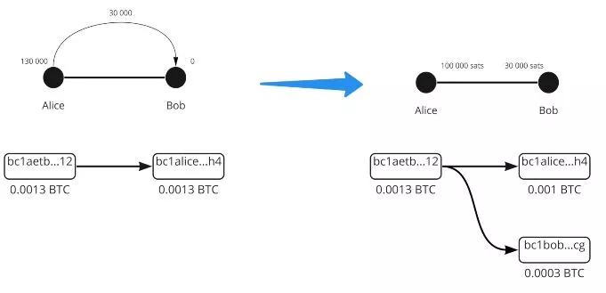

- Alice pošle 30 000 SAT Bobovi. Nyní existuje nová transakce výběru uvádějící, že v případě uzavření obdrží Alice 100 000 SAT a Bob 30 000 SAT. Oba souhlasí, protože je to spravedlivé.

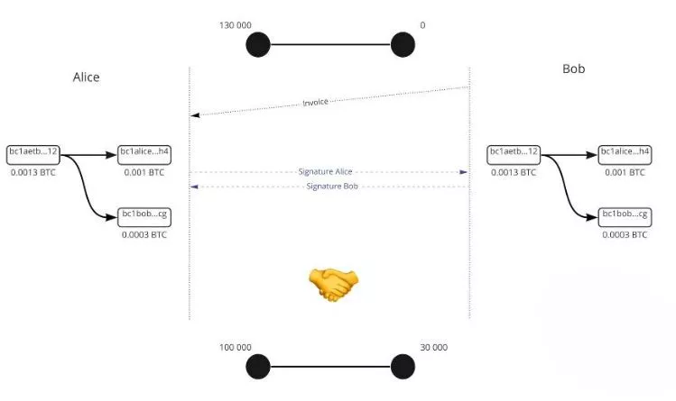

- Alice pošle 10 000 SAT Bobovi, a je vytvořena nová transakce výběru uvádějící, že Alice obdrží 90 000 SAT a Bob 40 000 SAT v případě uzavření. Oba souhlasí, protože je to spravedlivé.


```
Počáteční stav kanálu:
Alice (130 000 SAT) =============== Bob (0 SAT)

Po prvním převodu:
Alice (100 000 SAT) =============== Bob (30 000 SAT)

Po druhém převodu:
Alice (90 000 SAT) =============== Bob (40 000 SAT)

```

Peníze se nikam nepohnou, ale konečný zůstatek je aktualizován prostřednictvím podepsané, ale nezveřejněné transakce na blockchainu. Transakce výběru je tedy transakce závazku. Převody satoshi jsou další, novější transakce závazku, která aktualizuje zůstatek.

## Transakce závazku
<chapterId>f2f61e5b-badb-5947-9a81-7aa530b44e59</chapterId>

Pokud transakce závazku určují stav kanálu s likviditou v čase X, můžeme podvádět zveřejněním starého stavu? Odpověď je ano, protože už máme před-podepsání obou účastníků v nezveřejněné transakci.


Abychom tento problém vyřešili, přidáme složitost:

- Časový zámek (Timelock) = prostředky uzamčené do bloku N
- Klíč pro zrušení (Revocation key) = Alicino tajemství a Bobovo tajemství

Tyto dva prvky jsou přidány do transakce závazku. V důsledku toho musí Alice počkat na konec Časového zámku, a kdokoli drží klíč pro zrušení, může pohnout prostředky bez čekání na konec Časového zámku. Pokud se Alice pokusí podvádět, Bob použije klíč pro zrušení, aby ji okradl a potrestal.


Nyní (a ve skutečnosti) není transakce závazku stejná pro Alici a Boba, jsou symetrické, ale každá s různými omezeními, dávají si navzájem své tajemství, aby vytvořili revokační klíč předchozí transakce závazku. Takže při vytváření, Alice vytvoří kanál s Bobem, 130 000 SAT na její straně, má Timelock, který jí brání okamžitě získat zpět své peníze, musí chvíli počkat. Revokační klíč může peníze odemknout, ale má ho jen Alice (Alicina transakce závazku). Jakmile dojde k převodu, Alice poskytne své staré tajemství Bobovi a ten tak bude moci kanál vyprázdnit do předchozího stavu v případě, že by se Alice pokusila podvádět (Alice je tedy potrestána).
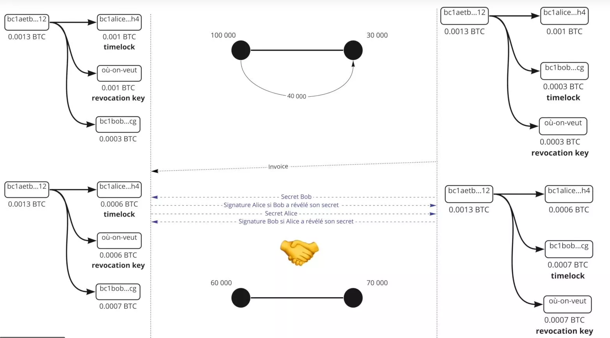

Podobně Bob poskytne své tajemství Alici. Takže pokud by se pokusil podvádět, Alice ho může potrestat. Operace se opakuje pro každou novou transakci závazku. Je rozhodnuto o novém tajemství a novém revokačním klíči. Takže pro každou novou transakci musí být předchozí transakce závazku zničena poskytnutím revokačního tajemství. Takže pokud se Alice nebo Bob pokusí podvádět, druhý může jednat dříve (díky Timelocku) a tím podvádění zabránit. Během transakce č. 3 je tedy tajemství transakce č. 2 poskytnuto, aby umožnilo Alici a Bobovi bránit se proti Alici nebo Bobovi.


Osoba, která vytváří transakci s Timelockem (ta, která posílá peníze), může revokační klíč použít až po Timelocku. Osoba, která peníze přijímá, ho však může použít před Timelockem v případě podvodu z jedné strany kanálu na druhou v síti Lightning Network. Zejména detailně popisujeme mechanismy, které nám umožňují bránit se možnému podvodu ze strany partnera v kanálu.

## Uzavření kanálu
<chapterId>29a72223-2249-5400-96f0-3756b1629bc2</chapterId>

Zajímáme se o uzavření kanálu prostřednictvím Bitcoinové transakce, které může mít v závislosti na případu různé formy. Existují 3 typy uzavření kanálu:

- Dobré: kooperativní uzavření
- Hrubé: vynucené uzavření (nekooperativní)
- Podvodné: uzavření podvodníkem


### Dobré

Obě strany komunikují a dohodnou se na uzavření kanálu. Zastaví veškeré transakce a ověří konečný stav kanálu. Dohodnou se na poplatcích sítě (osoba, která kanál otevřela, platí poplatky za uzavření). Nyní vytvoří uzavírací transakci. Ta se liší od transakcí závazku, protože nemá Timelock ani revokační klíč. Transakce je poté zveřejněna a Alice a Bob obdrží své příslušné zůstatky. Tento typ uzavření je rychlý (protože neexistuje Timelock) a obecně levný.

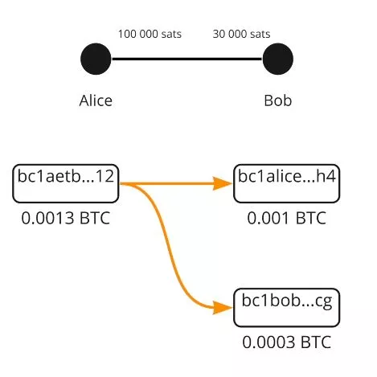


### Hrubé

Alice chce kanál uzavřít, ale Bob nereaguje, protože je offline (výpadek internetu nebo elektřiny). Alice poté zveřejní nejnovější transakci závazku (poslední). Transakce je zveřejněna a aktivuje se Timelock. Poté byly poplatky rozhodnuty, když byla tato transakce vytvořena před časem X! MemPool je síť, která se od té doby změnila, takže protokol výchozí nastavení poplatků na 5krát vyšší než byly v době vytvoření transakce. Poplatek za vytvoření 10 SAT, takže transakce je považována za 50 SAT. V době vynuceného uzavření je síť:
- 1 SAT = přeplaceno o 50\* - 100 SAT = nedoplaceno o 2\*

To způsobuje, že nucené uzavření je delší (Timelock) a zejména riskantnější z hlediska poplatků a možného ověření těžaři.


### Podvodník

Alice se pokusí podvádět tím, že zveřejní starou transakci závazku. Ale Bob sleduje MemPool a hledá transakce, které se pokoušejí zveřejnit staré. Pokud nějakou najde, použije klíč pro zrušení, aby potrestal Alici a vzal všechny SAT z kanálu.

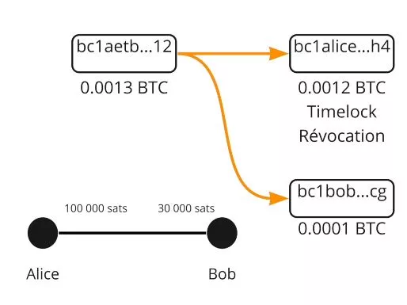

Závěrem, uzavření kanálu v Lightning Network je klíčovým krokem, který může nabývat různých forem. Při kooperativním uzavření obě strany komunikují a dohodnou se na konečném stavu kanálu. To je nejrychlejší a nejméně nákladná možnost. Na druhou stranu, nucené uzavření nastane, když jedna ze stran nereaguje. Jedná se o dražší a delší situaci kvůli nepředvídatelným poplatkům za transakce a aktivaci Timelocku. Nakonec, pokud účastník se pokusí podvádět tím, že zveřejní starou transakci závazku, podvodník, může být potrestán ztrátou všech SAT z kanálu. Je tedy zásadní tyto mechanismy chápat pro efektivní a spravedlivé používání Lightning Network.

# Síť likvidity
<partId>a873f1cb-751f-5f4a-9ed7-25092bfdef11</partId>

## Lightning Network
<chapterId>45a7252c-fa4f-554b-b8bb-47449532918e</chapterId>

V této sedmé kapitole studujeme, jak Lightning funguje jako síť kanálů a jak jsou platby směrovány od jejich zdroje k jejich cíli.


Lightning je síť platebních kanálů. Tisíce vrstevníků se svými vlastními kanály likvidity jsou propojeni mezi sebou, a tak se sami používají k provádění transakcí mezi nepropojenými vrstevníky. Likvidita těchto kanálů nemůže být převedena na jiné kanály likvidity.

Alice -> Eden -> Bob`. Satoshi se nepohnuli z `Alice -> Bob`, ale z `Alice -> Eden` a z `Eden -> Bob`.

Takže každá osoba a kanál má různou likviditu. Pro provedení plateb je třeba najít trasu v síti s dostatečnou likviditou. Pokud není dostatek, platba neprojde.

Zvažte následující síť:

```
Počáteční stav sítě:
Alice (130 SAT) ==== (0 SAT) Susie (90 SAT) ==== (200 SAT) Eden (150 SAT) ==== (100 SAT) Bob
```


Pokud má Alice převést 40 SAT na Boba, pak se likvidita přerozdělí podél trasy mezi oběma stranami.

```
Po převodu 40 SAT od Alice na Boba:
Alice (90 SAT) ==== (40 SAT) Susie (50 SAT) ==== (240 SAT) Eden (110 SAT) ==== (140 SAT) Bob
```


Nicméně, v počátečním stavu nemůže Bob poslat 40 SAT Alici, protože Susie nemá žádnou likviditu s Alicí, aby poslala 40 SAT, takže platba přes tuto trasu není možná. Proto potřebujeme jinou trasu, kde je transakce nemožná.

V prvním příkladu je jasné, že Susie a Eden nic neztratili a nic nezískali. Uzly Lightning Network účtují poplatek za souhlas s použitím k směrování transakce!
Existují různé poplatky v závislosti na tom, kde se likvidita nachází
Alice - Bob

- Poplatek Alice = Alice -> Bob
- Poplatek Boba = Bob -> Alice


Existují dva typy poplatků:

- fixní poplatek bez ohledu na částku: 1 SAT (výchozí, ale lze upravit)
- variabilní poplatek (standardně 0,01 %)

Příklad poplatků:

- Alice - Susie; 1/1 (1 fixní poplatek a 1 variabilní poplatek)
- Susie - Eden; 0/200
- Eden - Bob; 1/1

Tedy:

- Poplatek 1: (platí Alice sama sobě) 1 + (40,000\*0.000001)
- Poplatek 2: 0 + 40,000 \* 0.0002 = 8 SAT
- Poplatek 3: 1 + 40,000\* 0.000001 = 0.4 SAT


Doprava:

1. Zásilka 40,009.04 Alice -> Susie; Alice platí své vlastní náklady, takže se to nepočítá
2. Susie dělá Edenovi laskavost a posílá 40 001.04; bere si tuto provizi 8 SAT
3. Eden poskytuje službu poslání 40,000 Bobovi, bere si svůj poplatek 1.04 SAT.

Alice zaplatila poplatek 9.04 SAT a Bob obdržel 40,000 SAT.


V Lightning Network je to uzel Alice, který rozhoduje o trase před odesláním platby. Proto se hledá nejlepší trasa a Alice je jediná, kdo zná trasu a cenu. Platba je odeslána, ale Susie nemá žádné informace.


Pro Susie nebo Edena: nevědí, kdo je konečný příjemce, ani kdo platbu posílá. To je onion routing. Uzel musí udržovat plán sítě, aby našel svou trasu, ale žádný z prostředníků nemá žádné informace.

## HTLC - Hashed Time Locked Contract
<chapterId>4369b85a-1365-55d8-99e1-509088210116</chapterId>

V tradičním směrovacím systému, jak můžeme zajistit, aby Eden nepodváděl a dodržel svou část smlouvy?

HTLC je platební smlouva, která může být odemčena pouze s tajemstvím. Pokud není odhaleno, pak smlouva vyprší. Jedná se tedy o podmíněnou platbu. Jak se používají?


Zvažte následující situaci:
`Alice (100,000 SAT) ==== (30,000 SAT) Susie (250,000 SAT) ==== (0 SAT) Bob`

- Bob generuje tajemství S (preimage) a vypočítá hash r = hash(s)
- Bob pošle Alice fakturu s "r" zahrnutým
- Alice pošle HTLC 40,000 SAT Susie s podmínkou odhalení "s'" tak, že hash(s') = r
- Susie pošle podobné HTLC Bobovi
- Bob odemkne HTLC Susie ukázáním "s"
- Susie odemkne HTLC Alice ukázáním "S"

Pokud je Bob offline a nikdy nezíská tajemství, které mu dává legitimitu přijímat peníze, pak HTLC vyprší po určitém počtu bloků.

HTLC vyprší v opačném pořadí: nejprve vyprší Susie-Bob, poté Alice-Susie. Tímto způsobem, pokud se Bob vrátí, nic se nezmění. Jinak, pokud Alice zruší, zatímco se Bob vrací, vznikne zmatek a lidé mohou pracovat zbytečně.

Tak co se stane v případě uzavření? Ve skutečnosti jsou naše závazkové transakce ještě složitější. Musíme reprezentovat mezičasový zůstatek, pokud je kanál uzavřen.

Proto je v závazkové transakci HTLC-out 40 000 satoshi (s omezeními viděnými dříve) prostřednictvím výstupu č. 3.


Alice má ve závazkové transakci:

- Výstup č. 1: 60 000 SAT pro Alice prostřednictvím časového zámku a klíče pro zrušení (co jí zůstává)
- Výstup č. 2: 30 000, které již patří Susie
- Výstup č. 3: 40 000 v HTLC

Závazková transakce Alice je s HTLC-out, protože posílá HTLC-in příjemci, Susie.


Pokud tedy zveřejníme tuto závazkovou transakci, Susie může získat peníze HTCL s obrázkem "s". Pokud nemá předobraz, Alice získá peníze jakmile HTCL vyprší. Představte si výstupy (UTXO) jako různé platby s různými podmínkami.
Jakmile je platba provedena (vypršení platnosti nebo provedení), stav kanálu se změní a transakce s HTCL již neexistuje. Vracíme se k něčemu klasickému.
V případě kooperativního uzavření: zastavíme platby a tedy čekáme na provedení převodů/HTCL, transakce je lehká, takže méně nákladná, protože existuje maximálně 1 nebo 2 výstupy.
Pokud je uzavření vynucené: zveřejníme vše s probíhajícími HTLC, takže se to stává velmi těžkým a velmi nákladným. A je to zmatek.

Shrnutí, systém směrování Lightning Network používá Hash Time-Locked Contracts (HTLC) k zajištění bezpečných a ověřitelných plateb. HTLC umožňují podmíněné platby, kde peníze mohou být odemčeny pouze s tajemstvím, čímž zajišťují, že účastníci splní své závazky.
V prezentovaném příkladu chce Alice poslat SAT Bobovi přes Susie. Bob vygeneruje tajemství, vytvoří z něj hash a přenese jej Alici. Alice a Susie nastaví HTLC na základě tohoto hashe. Jakmile Bob odemkne HTLC Susie ukázáním jí tajemství, Susie pak může odemknout HTLC Alice.
V případě, že Bob neodhalí tajemství v určitém časovém období, HTLC vyprší. Vypršení platnosti probíhá v opačném pořadí, což zajišťuje, že pokud se Bob vrátí online, nedojde k nežádoucím následkům.

Při uzavírání kanálu, pokud jde o kooperativní uzavření, platby jsou přerušeny a HTLC jsou vyřešeny, což je obecně méně nákladné. Pokud je uzavření vynucené, všechny probíhající HTLC transakce jsou zveřejněny, což se může stát velmi nákladným a zmateným.
Shrnutí, mechanismus HTLC přidává další vrstvu bezpečnosti do Lightning Network, zajišťující, že platby jsou správně provedeny a uživatelé plní své závazky.

## Najít cestu
<chapterId>7e2ae959-c2a1-512e-b5d6-8fd962e819da</chapterId>

Jediná veřejná data jsou celková kapacita kanálu (Alice + Bob), ale nevíme, kde se nachází likvidita.
Pro získání více informací náš uzel naslouchá komunikačnímu kanálu LN pro oznámení nových kanálů a aktualizace poplatků za kanál. Váš uzel také sleduje blockchain pro uzavření kanálů.
Jelikož nemáme veškeré informace, musíme hledat graf/trasu s informacemi, které máme (maximální kapacita kanálu a ne kde se nachází likvidita).

Kritéria:

- Pravděpodobnost úspěchu - Poplatky
- Čas expirace HTLC
- Počet mezilehlých uzlů
- Náhodnost


Pokud tedy existují 3 možné trasy:

- Alice > 1 > 2 > 5 > Bob
- Alice > 1 > 2 > 4 > 5 > Bob
- Alice 1 > 2 > 3 > Bob

Hledáme teoreticky nejlepší trasu s nejnižšími poplatky a nejvyšší šancí na úspěch: maximální likvidita a co nejméně skoků.

Například, pokud 2-3 má kapacitu pouze 130 000 SAT, odeslání 100 000 je velmi nepravděpodobné, takže možnost #3 nemá šanci na úspěch.

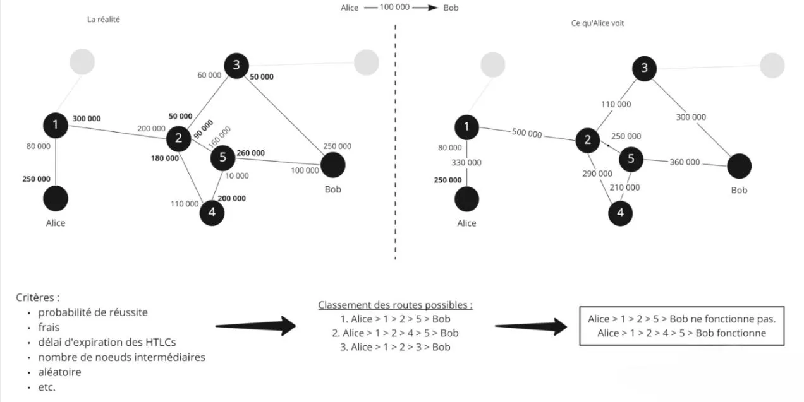

Nyní algoritmus učinil své 3 volby a pokusí se o první:

Volba 1:

- Alice pošle HTLC 100 000 SAT na 1;
- 1 pošle HTLC 100 000 SAT na 2;
- 2 pošle HTLC 100 000 SAT na 5, ale 5 to nemůže provést, tak to oznámí.

Informace jsou poslány zpět, takže Alice se rozhodne zkusit druhou trasu:

- Alice pošle HTLC 100 000 na 1;
- 1 pošle HTLC 100 000 na 2;
- 2 pošle HTLC 100 000 na 4;
- 4 pošle HTLC 100 000 na Boba. Bob má likviditu, takže je to v pořádku.
- Bob použije preimage (hash) HTLC a tím použije tajemství k získání 100 000 SAT
- 5 nyní má tajemství HTLC k získání zablokovaného HTLC od 4
- 4 nyní má tajemství HTLC k získání zablokovaného HTLC od 2
- 2 nyní má tajemství HTLC k získání zablokovaného HTLC od 1
- 1 nyní má tajemství HTLC k získání zablokovaného HTLC od Alice

Alice neviděla selhání trasy 1, jen čekala o sekundu déle. Selhání platby nastane, když není možná žádná trasa. Aby se usnadnilo hledání trasy, Bob může poskytnout Alici informace, které jí pomohou s její fakturou:

- Částka
- Jeho adresa
- Hash preimage, aby Alice mohla vytvořit HTLC
- Indikace o kanálech Boba

Bob zná likviditu kanálů 5 a 3, protože je k nim přímo připojen, může toto Alici naznačit. Upozorní Alici, že uzel 3 je zbytečný, což brání Alici v potenciálním vytvoření její trasy.
Dalším prvkem by mohly být soukromé kanály (tedy nezveřejněné v síti), které Bob může mít. Pokud má Bob soukromý kanál s 1, může říct Alici, aby ho použila, a to by dalo Alici > 1 > Bob'.

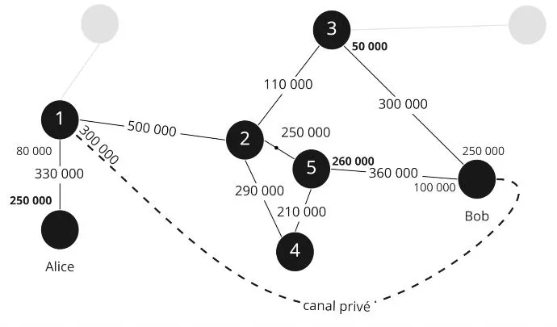
Na závěr, směrování transakcí v Lightning Network je složitý proces, který vyžaduje zohlednění různých faktorů. Ačkoliv celková kapacita kanálů je veřejná, přesné rozdělení likvidity přímo dostupné není. To nutí uzly odhadovat nejpravděpodobnější úspěšné trasy, přičemž berou v úvahu kritéria jako jsou poplatky, doba expirace HTLC, počet mezilehlých uzlů a faktor náhodnosti. Když je možných více tras, uzly se snaží minimalizovat poplatky a maximalizovat šance na úspěch výběrem kanálů s dostatečnou likviditou a minimálním počtem skoků. Pokud pokus o transakci selže kvůli nedostatečné likviditě, je vyzkoušena další trasa, dokud není transakce úspěšně provedena.
Dále, aby se usnadnilo hledání trasy, může příjemce poskytnout další informace, jako je adresa, částka, hash předobrazu a indikace o jejich kanálech. To může pomoci identifikovat kanály s dostatečnou likviditou a vyhnout se zbytečným pokusům o transakci. Nakonec je systém směrování Lightning Network navržen tak, aby optimalizoval rychlost, bezpečnost a efektivitu transakcí při zachování soukromí uživatele.

# Nástroje Lightning Network
<partId>74d6c334-ec5d-55d9-8598-f05694703bf6</partId>

## Faktura, LNURL, Keysend
<chapterId>e34c7ecd-2327-52e3-b61e-c837d9e5e8b0</chapterId>


Faktura LN (nebo faktura) je dlouhá a nepříjemná na čtení, ale umožňuje hustou reprezentaci žádosti o platbu.

Příklad:
lnbc1m1pskuawzpp5qeuuva2txazy5g483tuv9pznn9ft8l5e49s5dndj2pqq0ptyn8msdqqcqzpgxqrrsssp5v4s00u579atm0em6eqm9nr7d0vr64z5j2sm5s33x3r9m4lgfdueq9qyyssqxkjzzgx5ef7ez3dks0laxayx4grrw7j22ppgzyhpydtv6hmc39skf9hjxn5yd3kvv7zpjdxd2s7crcnemh2fz26mnr6zu83w0a2fwxcqnvujl3

- lnbc1m = čitelná část
- 1 = oddělení od zbytku
- Pak zbytek
- Bc1 = kódování Bech32 (základ 32), takže se používá 32 znaků.
- 10 = 1.2.3.4.5.6.7.8.9.0
- 26 = abcdefghijklmnopqrstuvwxyz
- 32 = ne "b-i-o" a ne "1"

### lnbc1m

- ln = Lightning
- Bc = bitcoin (hlavní síť)
- 1 = částka
- M = mili (10^-3 / u = mikro 10^-6 / n = nano 10^-9 / p = piko 10^-12'
  Zde 1m = 1 * 0.0001btc = 100,000 BTC
Prosím, zaplaťte 100 000 SAT v síti Lightning na Bitcoin mainnetu na adresu pskuawzpp5qeuuva2txazy5g483tuv9pznn9ft8l5e49s5dndj2pqq0ptyn8msdqqcqzpgxqrrsssp5v4s00u579atm0em6eqm9nr7d0vr64z5j2sm5s33x3r9m4lgfdueq9qyyssqxkjzzgx5ef7ez3dks0laxayx4grrw7j22ppgzyhpydtv6hmc39skf9hjxn5yd3kvv7zpjdxd2s7crcnemh2fz26mnr6zu83w0a2fwxcqnvujl3
### Časové razítko (kdy bylo vytvořeno)

Obsahuje 0 nebo více dalších částí:

- Hash předobrazu
- Tajemství platby (onion routing)
- Libovolná data
- Veřejný klíč příjemce LN
- Čas vypršení platnosti (výchozí 1 hodina)
- Nápovědy pro směrování
- Podpis celého

Existují i jiné typy faktur. Meta-protokol LNURL umožňuje poskytnout přímou částku v satoshi místo vytváření požadavku. To je velmi flexibilní a umožňuje mnoho vylepšení z hlediska uživatelské zkušenosti.


Keysend umožňuje Alici poslat peníze Bobovi bez Bobova požadavku. Alice získá Bobovo ID, vytvoří předobraz bez Bobova dotazu a zahrne jej do své platby. Takže Bob obdrží překvapivý požadavek, kde může peníze odemknout, protože Alice už udělala práci.


Závěrem, faktura Lightning Network, ačkoliv na první pohled složitá, efektivně kóduje požadavek na platbu. Každá část faktury obsahuje klíčové informace, včetně částky k platbě, příjemce, časového razítka vytvoření a potenciálně dalších informací, jako je hash předobrazu, tajemství platby, nápovědy pro směrování a čas vypršení platnosti. Protokoly jako LNURL a Keysend nabízejí významná vylepšení z hlediska flexibility a uživatelské zkušenosti, umožňují například posílat prostředky bez předchozího požadavku od druhé strany. Tyto technologie činí proces platby hladší a efektivnější v síti Lightning.

## Správa likvidity
<chapterId>cc76d0c4-d958-57f5-84bf-177e21393f48</chapterId>

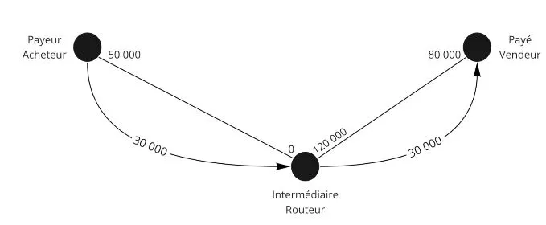

Poskytujeme několik obecných pokynů k odpovědi na neustálou otázku správy likvidity v Lightning.

V LN existují 3 typy lidí:

- Kupující: mají odchozí likviditu, což je nejjednodušší, protože stačí otevřít kanály
- Obchodníci: je to složitější, protože potřebují příchozí likviditu od ostatních uzlů a aktérů. Musí mít lidi, kteří jsou k nim připojeni
- Směrovací uzly: chtějí mít vyváženou likviditu na obou stranách a dobrou spojenost s mnoha uzly, aby byli co nejvíce využíváni

Pokud tedy potřebujete příchozí likviditu, můžete si ji koupit od služeb.

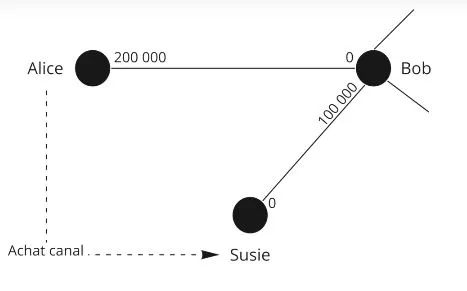

Alice kupuje kanál od Susie za 1 milion satoshi, takže otevře kanál přímo s 1 000 000 SAT na příchozí straně. Poté může přijímat platby až do výše 1 milionu SAT od zákazníků, kteří jsou spojeni se Susie (která je dobře propojena).
Dalším řešením by bylo provádět platby; zaplatíte 100 000 z důvodu X, nyní můžete přijímat 100 000.


### Řešení Loop Out: Atomický swap LN - BTC

Alice 2 miliony - Susie 0


Alice chce poslat likviditu Susie, takže provede Loop out (speciální uzel, který nabízí profesionální službu pro vyrovnání LN/BTC).
Alice pošle 1 milion Loopu přes uzel Susie, takže Susie má likviditu a Loop pošle zůstatek on-chain zpět na uzel Alice.


Takže 1 milion jde Susie, Susie pošle 1 milion Loopu, Loop pošle 1 milion Alice. Alice tedy přesunula likviditu Susie za cenu nějakých poplatků zaplacených Loopu za službu.

Nejsložitější věcí v LN je udržet likviditu.

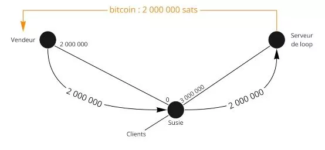

Závěrem, správa likvidity na Lightning Network je klíčovou otázkou, která závisí na typu uživatele: kupující, obchodník, nebo směrovací uzel. Kupující, kteří potřebují odchozí likviditu, mají nejjednodušší úkol: jednoduše otevřou kanály. Obchodníci, kteří vyžadují příchozí likviditu, musí být propojeni s ostatními uzly a aktéry. Směrovací uzly naopak usilují o udržení vyváženosti likvidity na obou stranách. Existuje několik řešení pro správu likvidity, jako je nákup kanálů nebo platba za zvýšení přijímací kapacity. Možnost "Loop Out", umožňující Atomický Swap mezi LN a BTC, nabízí zajímavé řešení pro vyrovnání likvidity. Přesto zůstává udržování likvidity na Lightning Network složitou výzvou.

# Jít dále
<partId>6bbf107d-a224-5916-9f0c-2b4d30dd0b17</partId>

## Souhrn kurzu
<chapterId>a65a571c-561b-5e1c-87bf-494644653c22</chapterId>

Naším cílem bylo vysvětlit, jak funguje Lightning Network a jak je závislá na Bitcoinu.

Lightning Network je síť platebních kanálů. Viděli jsme, jak funguje platební kanál mezi dvěma stranami, ale také jsme rozšířili naši vizi na celou síť, na pojem sítě platebních kanálů.


Kanály jsou otevřeny prostřednictvím Bitcoinové transakce a mohou obsahovat co nejvíce transakcí. Stav kanálu je reprezentován závaznou transakcí, která pošle každé straně to, co má na své straně kanálu. Když dojde k transakci v rámci kanálu, strany se zavážou k novému stavu tím, že zruší starý stav a vytvoří novou závaznou transakci.


Páry se chrání před podvody pomocí klíčů pro zrušení a časového zámku. Uzavření kanálu vzájemným souhlasem je preferováno. V případě nuceného uzavření se zveřejní poslední závazná transakce.


Platby mohou využívat kanály od jiných meziuzlů. Podmíněné platby na základě hash time lock (HTLC) umožňují uzamknout prostředky, dokud není platba plně vyřešena. V Lightning Network se používá onion routing. Meziuzly neznají konečný cíl plateb. Alice musí vypočítat platební trasu, ale nemá všechny informace o likviditě v meziuzlech.

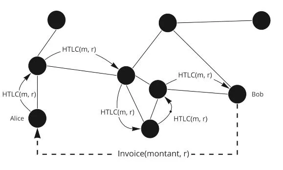

Při odesílání platby přes Lightning Network je prvek pravděpodobnosti.

Pro přijímání plateb je nutné spravovat likviditu v kanálech, což lze provést tím, že požádáme ostatní, aby nám otevřeli kanály, otevřeme si kanály sami, a používáme nástroje jako Loop nebo kupujeme/půjčujeme si kanály na tržištích.

## Rozhovor s Fanisem
<chapterId>077cb5f5-1626-5da5-9964-e67b1de503bf</chapterId>

Zde je shrnutí rozhovoru:

Lightning Network je ultra-rychlé platební řešení na Bitcoinu, které umožňuje obejít omezení související se škálovatelností sítě. Bitcoiny na Lightning Network však nejsou tak bezpečné jako ty na Bitcoinovém řetězci, protože decentralizace a bezpečnost mají přednost před škálovatelností.

Přílišné zvětšování velikosti bloku není dobrým řešením, protože ohrožuje uzly a kapacitu dat. Místo toho Lightning Network umožňuje vytváření platebních kanálů mezi dvěma uživateli Bitcoinu bez zobrazování transakcí na blockchainu, čímž šetří místo v blocích a umožňuje Bitcoinu škálovat dnes.

Existují však kritiky týkající se škálovatelnosti a centralizace Lightning Network, s potenciálními problémy souvisejícími s uzavíráním kanálů a vysokými transakčními poplatky. Pro řešení těchto problémů se doporučuje vyhýbat se otevírání malých kanálů, aby se předešlo budoucím problémům, a zvyšovat transakční poplatky pomocí Child Pay for Parent.

Řešeními pro budoucnost Lightning Network jsou hromadění a vytváření kanálů ve skupinách za účelem snížení transakčních poplatků, stejně jako zvýšení velikosti bloku v dlouhodobém horizontu. Je však důležité poznamenat, že bitcoiny na Lightning Network nejsou tak bezpečné jako bitcoiny na Bitcoinovém řetězci.

Soukromí na Bitcoinu a Lightning jsou propojeny, přičemž onion routing zajišťuje určitou úroveň soukromí pro transakce. Na Bitcoinu je však všechno výchozí transparentní, s heuristikami používanými pro sledování Bitcoinů z adresy na adresu na Bitcoinovém řetězci.

Koupě Bitcoinů s KYC umožňuje burze znát transakce výběru, zatímco kulaté částky a změnové adresy umožňují vědět, která část transakce je určena pro jinou osobu a která část je určena pro sebe.

Pro zlepšení soukromí umožňují společné akce a coinjoins narušit výpočty pravděpodobnosti tím, že více lidí provádí transakci společně. Společnosti provádějící analýzu řetězce mají těžší úkol zjistit, co děláte se svými bitcoiny sledováním.

Na Lightning Network jsou o transakci informovány pouze dvě osoby a je to důvěrnější než Bitcoin. Onion routing znamená, že meziuzel nezná odesílatele a příjemce platby.

Pro používání Lightning Network se doporučuje absolvovat školení na vašem YouTube kanálu nebo přímo na webu discover Bitcoin, nebo využít školení na Umbrell. Je také možné posílat libovolný text během platby na Lightning pomocí vyhrazeného pole pro tento účel, což může být užitečné pro dary nebo zprávy.
Je však důležité poznamenat, že směrovací uzly Lightning mohou být v budoucnu regulovány, přičemž některé státy se pokoušejí regulovat směrovací uzly. Pro obchodníky je nutné spravovat likviditu pro přijímání plateb na Lightning Network, s aktuálními omezeními, která lze překonat s vhodnými řešeními.

Nakonec, budoucnost Bitcoinu je slibná s možnou projekcí jednoho milionu za pět let. Pro zajištění profesionalizace průmyslu a vytvoření alternativního systému k existujícímu bankovnímu systému je důležité přispívat do sítě a přestat důvěřovat.


## Ohodnoťte kurz
<chapterId>38814c99-eb7b-5772-af49-4386ee2ce9b0</chapterId>
<isCourseReview>true</isCourseReview>

## Závěrečná zkouška
<chapterId>7ed33400-aef7-5f3e-bfb1-7867e445d708</chapterId>
<isCourseExam>true</isCourseExam>


## Poděkování a pokračujte v prozkoumávání králičí nory
<chapterId>afc0d72b-4fbc-5893-90b2-e27fb519ad02</chapterId>

Gratulujeme! 🎉
Úspěšně jste dokončili LN 201 školení - Úvod do Lightning Network!
Můžete být na sebe hrdí, protože to není snadné. Vězte, že málokdo se dostane tak hluboko do králičí nory Bitcoinu.
Především bych chtěl velmi poděkovat Fanisovi Michalakisovi za nabídnutí tohoto skvělého bezplatného kurzu zaměřeného na více etnický aspekt Lightning. Neváhejte ho sledovat na Twitteru, na jeho blogu nebo prostřednictvím jeho práce na LN market.
Pokud chcete projekt podpořit, neváhejte nás sponzorovat na Patreonu. Vaše dary budou použity na produkci obsahu pro nové výukové kurzy a samozřejmě budete první, kdo bude informován (včetně o Fanisově dalším kurzu, na kterém se pracuje!).

Dobrodružství s Lightning Network pokračuje s výcvikem Umbrel a implementací uzlu Lightning Network. Teorie je za námi a je čas na praxi s kurzem LN 202 teď!

Polibky a brzy na viděnou!
Rogzy'
